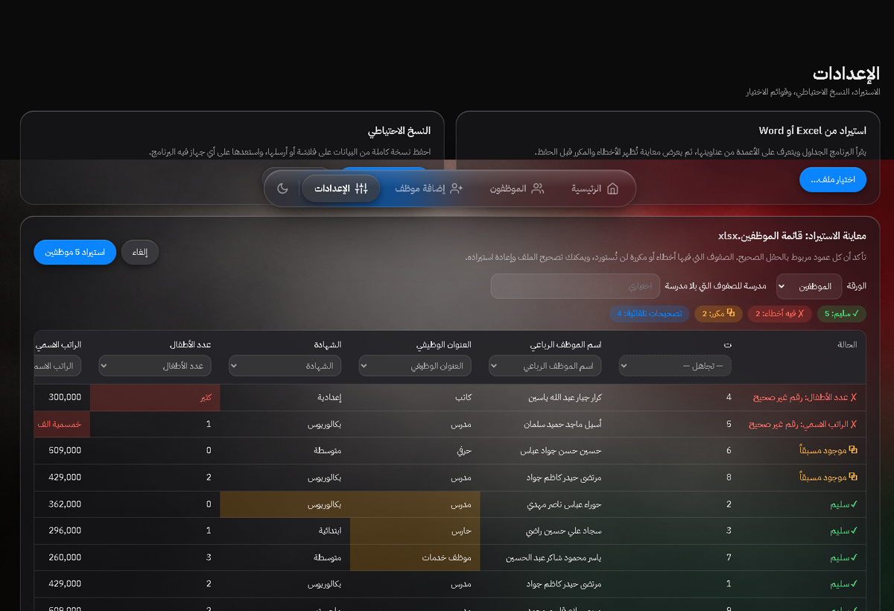
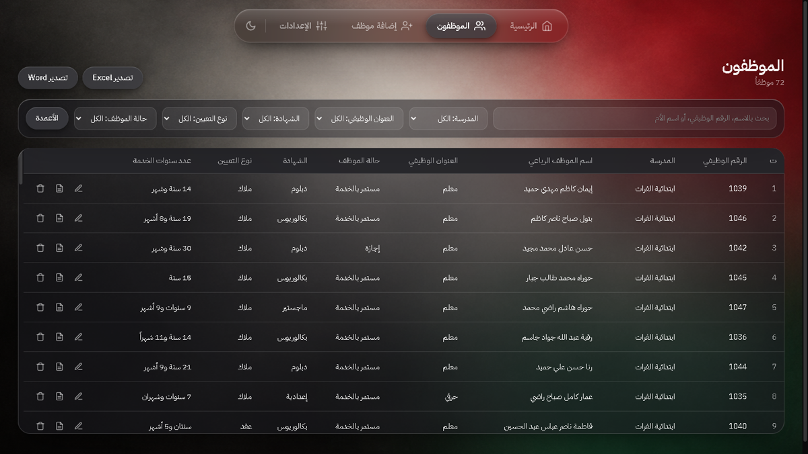

# نظام إدارة الموارد البشرية

برنامج ويندوز بالعربي لإدارة بيانات الموظفين: لوحة معلومات وتدقيق للبيانات، قائمة موظفين مع بحث وتصفية، استمارة كاملة تحسب سنوات الخدمة تلقائياً، استيراد وتصدير Excel وWord، ونسخ احتياطي. كل البيانات تبقى على جهازك.

**[⬇️ تحميل آخر إصدار لويندوز](https://github.com/DXN-crsis/hr-system/releases/latest/download/HR-Setup-1.0.0.exe)** · [الموقع](https://hr-system-ar.netlify.app)


## المميزات

| | |
|---|---|
| **لوحة المعلومات** | إجمالي الموظفين، السجلات المكتملة والناقصة، ومجموع الرواتب الاسمية، مع إحصائيات حسب المدرسة والعنوان الوظيفي والشهادة ونوع التعيين والحالة والجنس والحالة الزوجية. |
| **تدقيق البيانات** | يكشف السجلات الناقصة، والأسماء غير الرباعية، والأرقام الوظيفية المكررة، والموظفين المكررين — وبضغطة واحدة يعرض السجلات المعنية. |
| **قائمة الموظفين** | بحث فوري بالاسم أو الرقم الوظيفي أو اسم الأم، وتصفية حسب المدرسة والعنوان الوظيفي والشهادة ونوع التعيين وحالة الموظف، مع اختيار الأعمدة الظاهرة. |
| **استمارة الموظف** | حقول مرتّبة في مجموعات، حقول الزوج/الزوجة تظهر للمتزوج فقط وتاريخ التنسيب لموظفي العقود، وسنوات الخدمة تُحسب تلقائياً من تاريخ المباشرة، مع تنبيه عند التكرار. |
| **الاستيراد** | من Excel أو Word: يتعرّف على الأعمدة من عناوينها، يصحّح الأخطاء الإملائية والتواريخ تلقائياً، ويعرض معاينة بالأخطاء والمكرر قبل الحفظ. |
| **التصدير** | كشوف Excel وWord جاهزة للطباعة، وبطاقة بيانات لكل موظف بصيغة Word. |
| **النسخ الاحتياطي** | حفظ نسخة كاملة واستعادتها على أي جهاز فيه البرنامج. |





## التشغيل من المصدر

```bash
npm install
npm start          # تشغيل البرنامج
npm test           # فحص ذاتي لمنطق الاستيراد والتحقق
npm run dist       # بناء مثبّت ويندوز في مجلد dist
```

يتطلب Node.js 18 أو أحدث. البناء يُخرج `dist/HR-Setup-1.0.0.exe`.

## بنية المشروع

| الملف | الوظيفة |
|---|---|
| `main.js` | عملية Electron الرئيسية: النوافذ، قراءة وحفظ البيانات، فتح الملفات، تصدير Excel وWord. |
| `preload.js` | جسر آمن بين الواجهة والعملية الرئيسية (contextIsolation). |
| `logic.js` | المنطق الخالص: الحقول، تنظيف الصفوف، التواريخ، كشف المكرر، مطابقة عناوين الأعمدة، التدقيق. |
| `app.js` | الواجهة: الصفحات، الجداول، الاستمارة، الاستيراد، الإعدادات. |
| `index.html` · `style.css` | البنية والمظهر (تصميم زجاجي، وضع فاتح وداكن). |
| `check.js` | فحص ذاتي يعمل بدون متصفح: `npm test`. |

## البيانات

تُحفظ في ملف واحد على جهاز المستخدم:

```
%APPDATA%\HR System\data.json
```

لا يرسل البرنامج أي بيانات إلى أي جهة، ويمكن أخذ نسخة احتياطية منها من صفحة الإعدادات.
